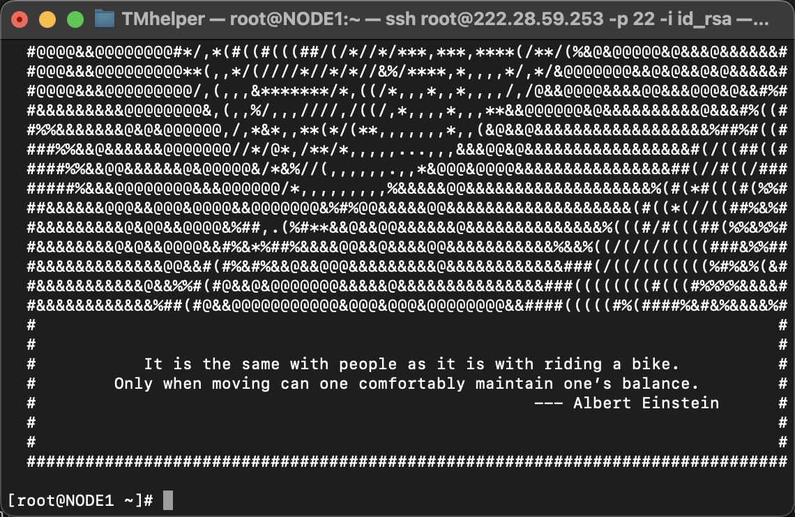

# 进入服务器

可能你会迷茫，但请你适应，在未来服务器的使用都将是命令行界面，所以你需要一个命令行的客户端来进入服务器。在这里我们只介绍`vscode`，至于其他方式连接服务器，如果你感兴趣的话可以问问我的本体，ChatGPT老师。

## 1. vscode下载

我们进入[vscode](https://code.visualstudio.com/download)官网，选择User Installer版本下载。


## 2. 安装Vscode插件

1. 在 VS Code 中安装 "Remote - SSH" 与“Remote Development”扩展插件。你可以通过在 VS Code 的扩展菜单中搜索 "Remote - SSH" 与“Remote Development” 来安装该插件。
2. 打开 VS Code 并单击左下角的 "Remote Explorer" 图标。

## 3. 连接服务器

在这里，我们在终端（黑色窗口）里输入以下命令，提示我们输入密码，密码请询问管理员

```shell
ssh biojump@222.28.59.253
```

登陆后我们可以看见以下界面，这是我们的跳板机（你可以理解成一个中转站），我们在跳板机上连接到我们的服务器。



我们在跳板机上登录自己的用户`leihu`

```shell
ssh leihu@192.168.1.29
```

初始密码为用户名，第一次登陆将提示我们修改密码


我们按照提示输入当前密码与新密码即可。

## 4. 免密登陆

我们会发现，每次都输入密码很麻烦，有没有什么策略可以让我在跳板机上免密登陆呢？答案是有的。我们首先在自己的终端输入

```shell
ssh-keygen -t rsa
```

会出现一系列提示，我们不用管，直接输入enter确认即可


然后我们再在自己的电脑终端输入

```shell
ssh-copy-id biojump@222.28.59.253
```

然后提示你输入密码，管理员给的那个，输入后我们就将钥匙对传输到了服务器上了，接着你再输入

```shell
ssh biojump@222.28.59.253
```

会惊奇发现不用输入密码了，跳板机同理，我们首先登陆进入跳板机，然后在跳板机上输入: 

```shell
ssh-copy-id leihu@192.168.1.29
```

其中`leihu`代表你的用户名，请修改成你自己的，然后输入密码。下一次在跳板机上登陆时就不需要输入密码了。

## 5. Vscode远程连接

这一步稍微困难一些，我们需要通过跳板机的设置进行连接，我们首先点击红框内的设置打开设置文件


会提示你进行选择，一般默认选第一个


我们在config文件中输入：

```shell
Host ustb_Jump
    HostName 222.28.59.253
    User biojump
    Port 22

Host ustb_Target
    HostName 192.168.1.29
    User leihu
    Port 22
    ProxyCommand ssh -q -W %h:%p ustb_Jump
```

注意Windows可能有所不同，需要输入的内容为

```
ProxyCommand C:\Windows\System32\OpenSSH\ssh.exe -W %h:%p ustb_Jump
```

输入完后记得按`ctrl+s`进行保存，然后右键进行连接


连接后的效果如图

