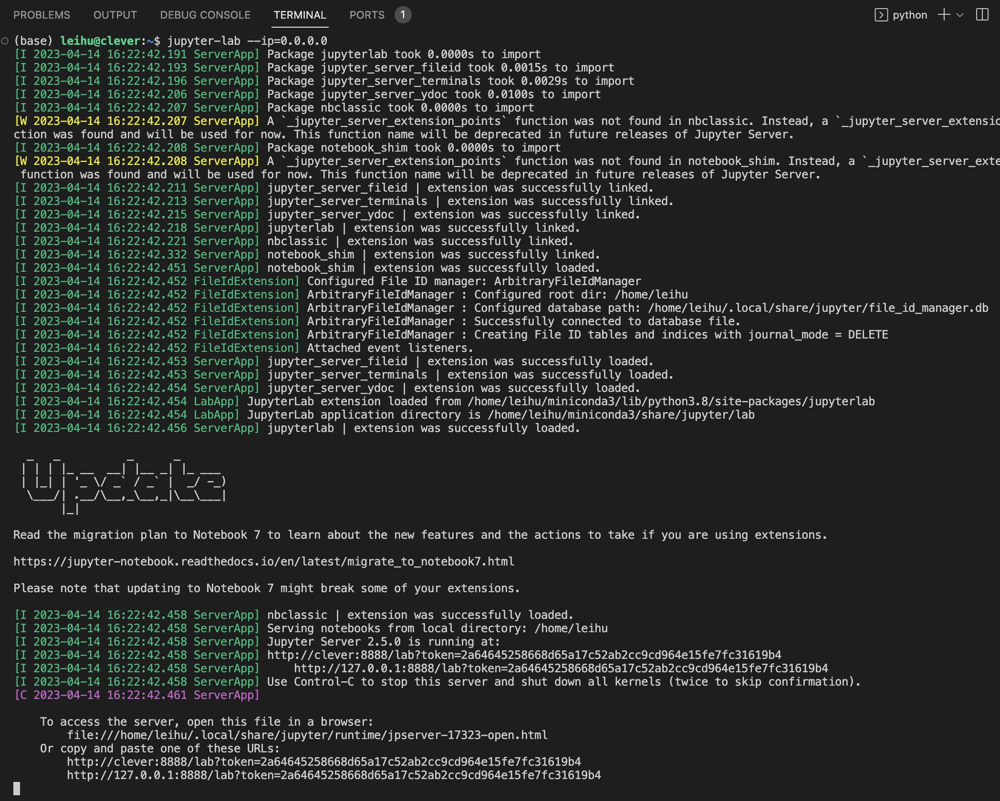
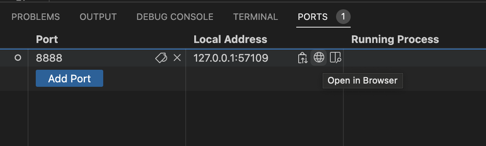

# jupyter-lab的构建

我知道，大家可能已经习惯jupyter-lab了，但是由于我们采用服务器并且是跳板机，所以一般情况下jupyter的访问会比较困难，不过我们可以采用vscode来解决这个问题。

## 1. jupyter-lab安装

在这里，我已经预先下载好了jupyter-lab的安装包，我们可以通过pip进行安装

```shell
pip install --no-index --find-links='/mnt/data/analysis/downloads' /mnt/data/analysis/downloads/jupyterlab-3.6.3-py3-none-any.whl
```

## 2. jupyter-lab运行

我们首先在`vscode`的`ssh-remote`登陆服务器，在我们的主目录下（一般是`/mnt/home/leihu`）下运行

```shell
jupyter-lab --ip=0.0.0.0
```



运行完后会出现这个界面，我们看到`PORTS`上多出了一个小灰点`1`，我们点击切换过去



然后选择在浏览器打开，即可完成端口转发。