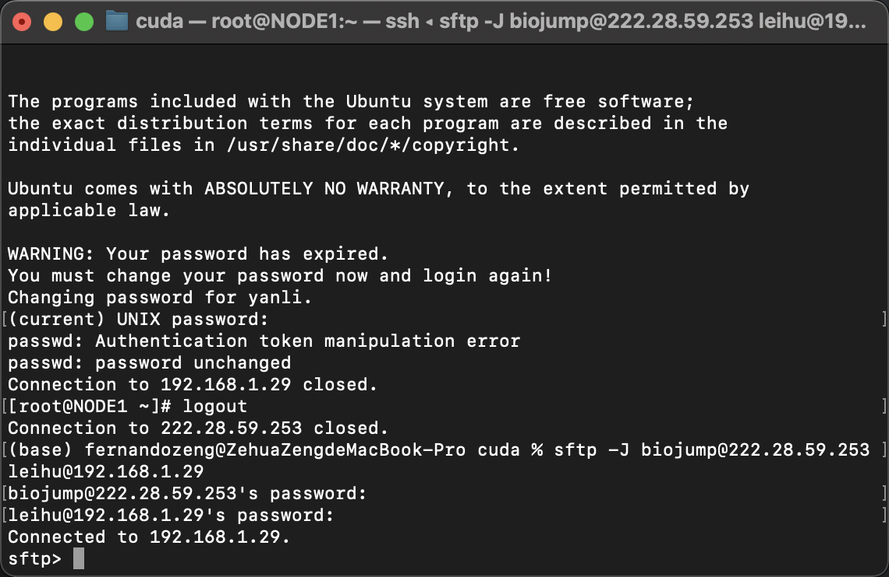

# 上传/下载服务器的文件

服务器的文件可能不像本地那么好传输，但是也不是没有办法，只是会稍微复杂一些，首先我们确保电脑的`sftp`命令可用，检查方法：在终端输入

```
sftp
```

看看会不会报错，一般系统都自带sftp，如果没有百度按提示安装即可。

## 1. 建立sftp传输

sftp是文件传输的协议，我们的服务器需要通过跳板机来连接，意味着我们向服务器传输文件可能会稍微麻烦一些。我们先配置好跳板机的免密登陆（具体见上一节，当然不配置也行），然后在终端输入

```shell
sftp -J biojump@222.28.59.253 leihu@192.168.1.29
```

这里的`leihu`为你自己的用户名，然后你会发现你进入了一个页面



## 2. sftp命令介绍

当你使用 sftp 客户端连接到远程服务器时，你可以使用 `put` 和 `mput` 命令上传文件或文件夹，使用 `get` 和 `mget` 命令下载文件或文件夹。以下是这些命令的介绍：

!!! note
    我们建议文件上传完成后，复制到`/mnt/data/leihu`目录下，`leihu`是你自己的用户名

- `put` 命令：将本地文件上传到远程服务器。

语法：`put local_file [remote_file]`

其中，`local_file` 表示本地文件路径，`remote_file` 表示远程服务器上的文件路径。如果不指定 `remote_file`，则默认将文件上传到远程服务器的当前工作目录。

例如，将本地的 `file.txt` 文件上传到远程服务器：

```shell
sftp> put /path/to/local/file.txt
```

- `mput` 命令：将本地文件夹中的所有文件上传到远程服务器。

语法：`mput local_folder/* [remote_folder]`

其中，`local_folder/*` 表示本地文件夹中的所有文件，`remote_folder` 表示远程服务器上的文件夹路径。如果不指定 `remote_folder`，则默认将文件夹上传到远程服务器的当前工作目录。

例如，将本地的 `local_folder` 文件夹中的所有文件上传到远程服务器：

```shell
sftp> mput /path/to/local_folder/*
```

- `get` 命令：从远程服务器下载文件。

语法：`get remote_file [local_file]`

其中，`remote_file` 表示远程服务器上的文件路径，`local_file` 表示本地文件路径。如果不指定 `local_file`，则默认将文件下载到本地当前工作目录。

例如，从远程服务器下载 `file.txt` 文件到本地：

```
sftp> get /path/to/remote/file.txt
```

- `mget` 命令：从远程服务器下载文件夹中的所有文件。

语法：`mget remote_folder/* [local_folder]`

其中，`remote_folder/*` 表示远程文件夹中的所有文件，`local_folder` 表示本地文件夹路径。如果不指定 `local_folder`，则默认将文件夹下载到本地当前工作目录。

例如，从远程服务器下载 `remote_folder` 文件夹中的所有文件到本地：

```shell
sftp> mget /path/to/remote_folder/*
```

这些命令将帮助你在 sftp 客户端中上传和下载文件。